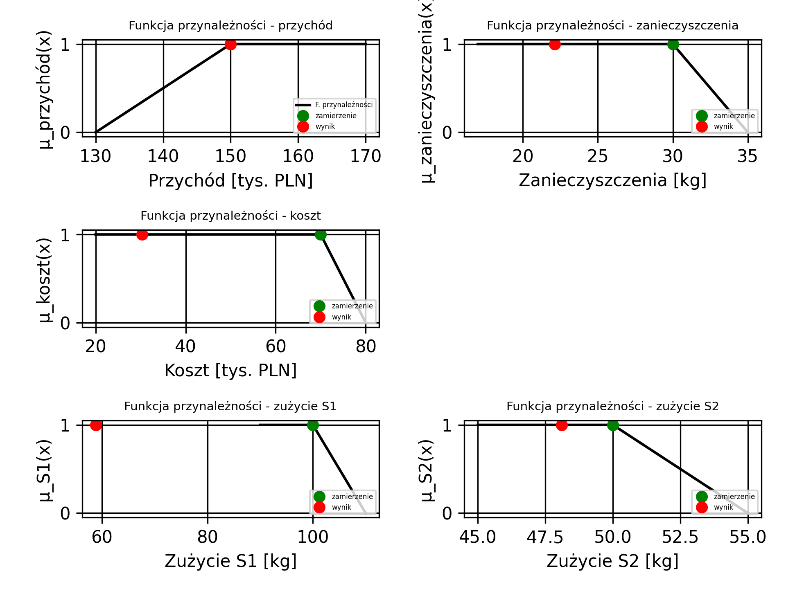

# MOM - Projekt 3
#### Bartosz Zaborowski 319996
#### Zestaw JG_z12

## Dane: 

| Składnik / Produkt | S1 | S2 | S3 | Cx | Zx | Kx |
|-------------------:|---:|---:|---:|---:|---:|---:|
|       P1           | 2  |  8 |  5 | 10 |  1 | 1  |
|       P2           | 8  |  1 |  1 | 22 |  1 | 3  |
|       P3           | 4  |  4 |  2 | 12 |  3 | 3  |

Gdzie:

- P1, P2, P3 (sztuki) --> Firma robi 3 produkty 
- S1, S2, S3 (kg / jednostkę) --> Każdy z produktów porzebuje trzech różnych składników
- KP1, KP2, KP3 (tyś.PLN / jednostkę) --> jednostkowe koszty produkcji
- Cp1, Cp2, Cp3 (tys PLN / za jednostkę) --> każdy z produktów ma inną cenę jednostkową sprzedaży (za jednostkę produktu)
- ZP1, ZP2, ZP3 (kg / jednostkę) --> poziom zanieczyszczeń emitowanych dla poszczególnych produktów

Rozpisane Ograniczenia: 

- S1 - użycie musi być w przedziale <100, 110>
- S2 - użycie musi być w przedziale <50, 55>
- S3 - użycie musi być <= 50
- Produkcja P1 >= 3
- Produkcja P3 >= 5

Rozpisane Cele:

- Maksymalizacja zysku --> zysk ma być w przedziale <130 000, 150 000>
- Minimalizacja emisji zanieczyszczeń --> emisje mają być w przedziale <30, 35>
- Minimalizacja kosztów produkcji --> koszty produkcji mają być w przedziale <70 000, 80 000>


## Opracowany ogólny model
Opracowany został model ogólny, który w zależności od potrzeb danego podpunktu zadania jest rozbudowywany o konkretne elementy wynikające z potrzeb konkretnego podpunktu. 

**Zbiory:**

- PRODUKTY = {P1, P2, P3} - produkty, które firma może wyprodukować
- SKLADNIKI = {S1, S2, S3} - składniki, z których firma może korzystać do produkcji produktów
- CELE = {S1, S2, przychod, ZANIECZYSZCZENIA, KOSZT} - zbiór zmiennych, dla których wyznaczone są jakieś ustalenia
- CELE_MINIMALIZACJA = {KOSZT, ZANIECZYSZCZENIA, S1, S2} - zbiór zmiennych, posiadających ustalenia minimalizacji
- CELE_MAKSYMALIZACJA = {przychod} - zbiór zmiennych, posiadających ustalenia maksymalizacji 

**Parametry** 

- $PRODUKT\_SKLADNIK[p][s], gdzie: \ p \in PRODUKTY, oraz\ s \in SKLADNIKI$ - ilość składnika S wymagana do wytworzenia jednostki produktu typu P.

dla:

$PRODUKT\_SKLADNIK[p][s]$   | S1 | S2 | S3
----------------------------|----|----|---
P1                          | 2  | 8  | 5
P2                          | 8  | 1  | 1
P3                          | 4  | 4  | 2


- $PRODUKT\_PRZYCHOD[p], gdzie\ p \in PRODUKTY$ - cena jednostkowa sprzedaży produktów (tys. PLN za jednostkę)

dla:

$PRODUKT$   | $PRODUKT\_PRZYCHOD$
------------|---------------------
P1          | 10
P2          | 22
P3          | 12

- $KOSZT\_PRODUKCJA[p],gdzie\ p \in PRODUKTY$ - jednostkowe koszty produkcji produktu typu $p$ (tyś.PLN na wyprodukowaną jednostkę),

dla:

$PRODUKTY$ | $KOSZT\_PRODUKCJA[p]$
-----------|----------------------
P1         | 1
P2         | 3
P3         | 3


- $POZIOM\_ZANIECZYSZCZEN\_PRODUKT[p], gdzie \ p \in PRODUKTY$ -  poziom zanieczyszczeń (jednostkowy), generowany dla poszczególnych produktów $p$ (kg na wyprodukowaną jednostkę),

dla:

$PRODUKTY$ | $POZIOM\_ZANIECZYSZCZEN\_PRODUKT[p]$
-----------|-------------------------
P1         | 1
P2         | 1
P3         | 3

Możemy również zapisać parametry, wynikające dodatkowo z zadanych ograniczeń:

- $SKLADNIKI\_UZYCIE\_MAX[s], gdzie\ s \in SKLADNIKI$ - ilość składnika s, którą możemy maksymalnie wykorzystać

$SKLADNIKI$ | $SKLADNIKI\_UZYCIE\_MAX[s]$
-------------|-----------------------------------
S1           | 110
S2           | 55
S3           | 50

- $PRODUKCJA\_MIN[p],\ p \in PRODUKTY$ - ilość sztuk produktu typu p jaką należy minimalnie wyprodukować (czyli co najmniej tyle produktu danego typu musi być wytworzone)

$PRODUKTY$ | $PRODUKCJA\_MIN[p]$
-----------|-------------------------
P1         | 3
P2         | 0
P3         | 5


- $PRZYCHOD\_MIN = 130$ - minimalny akceptowalny poziom zysków,
- $EMISJA\_ZANIECZYSZCZEN\_MAX = 35$ - maksymalny poziom emisji zanieczyszczeń, który jest jakkolwiek akceptowalny
- $KOSZT\_MAX = 80$ - maksymalny akceptowalny koszt, przy wytwarzaniu produktów

Parametry wynikające z "ustaleń" / "zamierzeń" firmy podanych w treści zadania:

- $ZAMIERZENIA[o],\ o \in CELE$ - zamierzenia wynikające z treści zadania, podane dla poszczególnych zmiennych.

$CELE$ 		 | $ZAMIERZENIA[o]$
-------------|-----------------
S1           | 100
S2           | 50
PRZYCHOD     | 150
ZANIECZYSZCZENIA    	 | 30
KOSZT        | 70


## Zmienne decyzyjne

- $PRODUKCJA[p],gdzie \ p \in PRODUKTY$ - ilość wyprodukowanych produktów typu $p$,
- $SKLADNIKI\_UZYCIE[s], gdzie\ s \in SKLADNIKI$ - wykorzystanie całkowite składnika typu $S$ do produkcji wszystkich produktów każdego typu łącznie,
- $PRZYCHOD$ - zmienna pomocnicza reprezentująca przychod całkowity ze sprzedaży produktów wszystkich typow,
- $ZANIECZYSZCZENIA$ - wygenerowane zanieczyszczenia całkowite, powstałe przy produkcji wszystkich produktów każdego typu łącznie,
- $KOSZT$ - sumaryczne koszty produkcji.


Aby uprościć zapis wzorów dotyczących "zamierzeń" postawionych przez firmę zdefiniowany został dodatkowy pomocniczy wektor zmiennych dec.:

$CELE[o],\ o \in CELE$ - zmienna pełniąca rolę agregującej dla kilku innych zmiennych, poniżej również zastosowane odpowiednie ograniczenia:
$$
CELE[S1] = SKLADNIKI\_UZYCIE[S1]
$$
$$
CELE[S2] = SKLADNIKI\_UZYCIE[S2]
$$
$$
CELE[PRZYCHOD] = PRZYCHOD
$$
$$
CELE[EMISJA\_ZANIECZYSZCZEN] = EMISJA\_ZANIECZYSZCZEN
$$
$$
CELE[KOSZT] = KOSZT
$$

Aby uprościć zapis wzorów dotyczących poziomów nieakceptowalnych również został zdefiniowany dodatkowy pomocniczy wektor (analogicznie co powyżej):

- $limity\_krytyczne[o],\ o \in CELE$ - zmienna pełniąca rolę agregującej dla kilku innych zmiennych, poniżej również zastosowane odpowiednie ograniczenia:
$$
limity\_krytyczne[S1] = SKLADNIKI\_UZYCIE\_MAX[S1];
$$
$$
limity\_krytyczne[S2] = SKLADNIKI\_UZYCIE\_MAX[S2];
$$
$$
limity\_krytyczne[EMISJA\_ZANIECZYSZCZEN] = EMISJA\_ZANIECZYSZCZEN\_MAX;
$$
$$
limity\_krytyczne[KOSZT] = KOSZT\_MAX;
$$
$$
limity\_krytyczne[PRZYCHOD] = PRZYCHOD\_MIN;
$$

## Ograniczenia modelu
Ograniczenia wynikające z treści zadania:

1. Wykorzystanie różnych składników do produkcji różnych produktów w różnych ilościach:

$$
SKLADNIKI\_UZYCIE[s] = \sum_{p \in PRODUKTY} PRODUKT\_SKLADNIK[p, s] \cdot PRODUKCJA[p]
$$

$$
dla: \forall{s \in SKLADNIKI}
$$

2. Zysk całkowity jako suma przychodów ze sprzedaży wszystkich wyprodukowanych typów produktów (P1, P2, P3) minus koszty produkcji:

$$
PRZYCHOD = (\sum_{p \in PRODUKTY} PRODUKT\_PRZYCHOD[p] \cdot PRODUKCJA[p]) - KOSZT
$$

3. Koszty wytworzenia poszczególnych produktów jako składowe całkowitego kosztu produkcji:
$$
KOSZT = \sum_{p \in PRODUKTY} KOSZT\_PRODUKCJA[p] \cdot PRODUKCJA[p]
$$

4. Na całkowity poziom emisji składają się poziomy zanieczyszczeń wytworzonych podczas produkcji poszczególnych produktów każdego typu:
$$
ZANIECZYSZCZENIA = \sum_{p \in PRODUKTY} POZIOM\_ZANIECZYSZCZEN\_PRODUKT[p] \cdot PRODUKCJA[p]
$$

Ograniczenia logiczne:

1. Minimalna produkcja dla poszczególnych produktów:
$$
\forall{p \in PRODUKTY}: PRODUKCJA[p] \ge PRODUKCJA\_MIN[p]
$$

2. Koszty produkcji nie mogą przekroczyć $KOSZT\_MAX$:
$$
KOSZT \le KOSZT\_MAX
$$

3. Limity wykorzystania składników:
$$
\forall{s \in SKLADNIKI}: SKLADNIKI\_UZYCIE[S] \le SKLADNIKI\_UZYCIE\_MAX[S]
$$

4. Nieujemność produkcji:
$$
\forall{p \in PRODUKTY}: PRODUKCJA[p] \ge 0
$$

5. Maksymalny poziom zanieczyszczeń nie większy niż EMISJA\_ZANIECZYSZCZEN\_MAX:
$$
ZANIECZYSZCZENIA \le EMISJA\_ZANIECZYSZCZEN\_MAX
$$

6. Zysk minimalny na poziomie co najmniej $PRZYCHOD\_MIN$:
$$
PRZYCHOD \ge PRZYCHOD\_MIN
$$

## Funkcja celu

Funkcje celu do optymalizacji będą definiowane, w zależności od podpunktu zadania


# Rozwiązania poszczególnych podpunktów:

## 1. Sformułować i opisać wielokryterialny model planowania produkcji z wykorzystaniem metody punktu odniesienia.

Ponieważ model będzie bazować na modelu ogólnym poniżej zostają zdefiniowane tylko dodatkowe parametry, ograniczenia i zmienne  wykraczające poza przygotowany wyżej model ogólny.

### Zbiory
- $ZAKRES = \{utopia, nadir\}$ - zbiór pomocniczy do ustalenia zakresu zm celu.

### Parameetry

- $\varepsilon  = 10^{-4} / 5 = 2 \cdot 10^{-5}$ - waga przyjmowana dla sumy zmiennych celu. Zapewnia, efektywność każdego otrzymanego rozwiązania

- $\beta = 10^{-3}$ - pozwala ograniczyć wzrost wartości funkcji oceny dla zmiennych decyzyjnych ponad zadany poziom ZAMIERZENIA. Funkcja oceny dla parametrów, które ten poziom osiągnęły będzie rosła o $\beta$ wolniej, niż dla tych zmiennych, które nie osiągnęły tego poziomu,

- $CELE\_ZAKRES[o][r],\ o \in CELE,\ r \in ZAKRES$ - wyliczone na podstawie bazowego modelu dla każdej zmiennej celu wartości utopii i nadiru:

$CELE\_ZAKRES[o][r]$ | utopia  | nadir
-------------------------|---------|--------
S1                       |48.5315  |110 
S2                       |47.0526  |55 
PRZYCHOD                   |271.774  |130 
ZANIECZYSZCZENIA                |21.0526  |28.8571  
KOSZT                     |26.7133  |49.7143  

### Zmienne decyzyjne

- $\lambda[o],\ o \in CELE$ - parametry normalizujące zakres zmienności kryteriów, zostały obliczone bazując na wartości utopii i nadiru dla poszczególnych celów $o$,

- $zadowolenie[o],\ o \in CELE$ - poziom zadowolenia wynikający z osiągnięcia poszczególnych wartości zmiennych celu $o$,

- $dolna\_granica$ - dolne ograniczenie wszystkich poziomów zadowolenia z osiągnięcia zamierzeń.

### Ograniczenia

1. Parametr normalizujący $\lambda$ na bazie wartości utopii i nadiru:

$$
\lambda[o] = 1 / (CELE\_ZAKRES[o][utopia] - CELE\_ZAKRES[o][nadir])
$$

2. Wprowadzamy zmienną $dolna\_granica$, która będzie mniejsza niż każde z poziomów zadowolenia:

$$
\forall{o \in CELE}: dolna\_granica \le zadowolenie[o]
$$

3. Poziom zadowolenia dla wartości przekraczających aspirację  pomniejszony o $\beta$:

$$
\forall{o \in CELE}: zadowolenie[o] \le \beta \cdot \lambda[o] \cdot (CELE[o] - ZAMIERZENIA[o])
$$

4.  Poziom zadowolenia rośnie liniowo z wartościami celu, aż do momentu osiągnięcia poziomu ZAMIERZENIA:

$$
\forall{o \in CELE}: zadowolenie[o] \le \lambda[o] \cdot (CELE[o] - ZAMIERZENIA[o])
$$

### Funkcja oceny

Maksymalizujemy najmniejszy poziom zadowolenia, następnie z mniejszą wagą maksymalizujemy zadowolenie całkowite:
$$
max(dolna\_granica + \varepsilon  \cdot \sum_{o \in CELE} zadowolenie[o])
$$

## 2. Sformułować i opisać wielokryterialny model optymalnego planowania produkcji z wykorzystaniem zbiorów rozmytych.

Jak wyżej (tzn. w podpunkcie 1) model będzie bazować na modelu ogólnym, poniżej zostają zdefiniowane tylko dodatkowe parametry, ograniczenia i zmienne  wykraczające poza przygotowany wyżej model ogólny.

### Zmienne decyzyjne

- $TOLERANCJA[o], o \in CELE$ - reprezentuje rozmycie ograniczeń (jest wartością stałą). Przyjmuję, że dla zmiennych z górnym nieakceptowalnym ograniczeniem występuje wartość dodatnia, natomiast dla tych z dolnym przyjęta zostaje wartość ujemna.

### Ograniczenia

1. Odejmuję od ustalonych nieprzekraczalnych limitów, zamierzeń firmy:

$$
\forall{o \in CELE}: TOLERANCJA[o] = limity\_krytyczne[o] - ZAMIERZENIA[o]
$$

### Ograniczenia rozmyte

1. Nie powinniśmy wykorzystać więcej składnika $S2$ niż zadany poziom ZAMIERZENIA z poziomem tolerancji równym $|TOLERANCJA[S2]|$:

$$
SKLADNIKI\_UZYCIE[S2] \underset{\sim}{\le} ZAMIERZENIA[S2]
$$

2. Nie powinniśmy wykorzystać więcej składnika $S1$ niż zadany poziom ZAMIERZENIA z poziomem tolerancji równym $|TOLERANCJA[S1]|$:

$$
SKLADNIKI\_UZYCIE[S1] \underset{\sim}{\le} ZAMIERZENIA[S1]
$$

### Cele rozmyte

1. Koszty całkowite chcemy aby były mniejsze niż zadany poziom ZAMIERZENIA przy poziomie tolerancji równym $|TOLERANCJA[KOSZT]|$:

$$
KOSZT \underset{\sim}{\le} ZAMIERZENIA[KOSZT]
$$

2. Zysk powinien przekroczyć poziom ZAMIERZENIA z poziomem tolerancji równym $|TOLERANCJA[PRZYCHOD]|$:

$$
PRZYCHOD \underset{\sim}{\le} ZAMIERZENIA[PRZYCHOD]
$$

3. Emisja zanieczyszczeń chcemy aby była mniejsza niż zadany poziom ZAMIERZENIA przy poziomie tolerancji równym $|TOLERANCJA[ZANIECZYSZCZENIA]|$:

$$
ZANIECZYSZCZENIA \underset{\sim}{\le} ZAMIERZENIA[ZANIECZYSZCZENIA]
$$


## 3. Sformułować równoważne zadanie optymalizacji dla zadania 2 z wykorzystaniem zbiorów rozmytych adaptując podejście Zimmermana dla więcej niż jednego kryterium.

Jak wyżej (tzn. w podpunkcie 1) model będzie bazować na modelu ogólnym, poniżej zostają zdefiniowane tylko dodatkowe parametry, ograniczenia i zmienne  wykraczające poza przygotowany wyżej model ogólny.

### Zmienne decyzyjne

- $TOLERANCJA[o], o \in CELE$ - reprezentuje rozmycie ograniczeń (jest wartością stałą). Przyjmuję, że dla zmiennych z górnym nieakceptowalnym ograniczeniem występuje wartość dodatnia, natomiast dla tych z dolnym przyjęta zostaje wartość ujemna.

- $\alpha$ - zmienna decyzyjna dla $\alpha$-przekrojów

### Ograniczenia

1. Odejmuję od ustalonych nieprzekraczalnych limitów, zamierzeń firmy:

$$
\forall{o \in CELE}: TOLERANCJA[o] = limity\_krytyczne[o] - ZAMIERZENIA[o]
$$

2. Zmienna $\alpha$ jest zmienną binarną a więc przyjmuje jedynie wartości [0; 1]. 

$$
0 \le \alpha \le 1
$$

- Uwaga: Przez to, że istnieje narzucone górne ograniczenie wartości $\alpha$, możemy otrzymać nie całkowicie najlepsze dostępne rozwiązanie, biorąc pod uwagę także inne kryteria.

### Ograniczenia rozmyte


1. Dla celów, które minimalizujemy (znak dla $TOLERANCJA[o]$ zależy od przyjętych założeń):
$$
\forall{o \in CELE\_MINIMALIZACJA}:
$$
$$
CELE[o] \le ZAMIERZENIA[o] + TOLERANCJA[o] \cdot (1 - \alpha)
$$


2. Ograniczenia dla celów, które maksymalizujemy (znak dla $TOLERANCJA[o]$ zależy od przyjętych założeń):
$$
\forall{o \in CELE\_MAKSYMALIZACJA}:
$$
$$
CELE[o] \ge ZAMIERZENIA[o] + TOLERANCJA[o] \cdot (1 - \alpha)
$$


### Model Ogólny

Poniżej opracowany model ogólny, z którego korzystają pozostałe modele (można powiedzieć, że jest on dla nich bazą):

**Plik z danymi: "parametry.dat"**

```py
data;

set PRODUKTY := P1 P2 P3;	# Produkty, ktore mozna produkowac
set SKLADNIKI := S1 S2 S3;	# Skladniki, ktore sa potrzebne do produkcji
set CELE := S1 S2 przychod zanieczyszczenia koszt;	# Cele optymalizacji
set CELE_MAKSYMALIZACJA := przychod;	# Cele, ktore chcemy maksymalizowac
set CELE_MINIMALIZACJA := S1 S2 zanieczyszczenia koszt;	# Cele, ktore chcemy minimalizowac

# Parametry
param PRODUKT_PRZYCHOD :=	# Przychod z produkcji poszczegolnych produktow
	P1   10,
	P2   22,
	P3   12;

param POZIOM_ZANIECZYSZCZEN_PRODUKT :=	# Poziom zanieczyszczenia generowany przez produkcje poszczegolnych produktow
	P1	1,
	P2  1,
	P3  3;

param KOSZT_PRODUKCJA :=	# Koszt produkcji poszczegolnych produktow
	P1	1,
	P2	3,
	P3	3;

param PRODUKT_SKLADNIK 	# Skladniki potrzebne do produkcji poszczegolnych produktow
	:	S1	S2	S3	:=
	P1  2   8   5
	P2  8   1   1
	P3  4   4   2	;

param SKLADNIKI_UZYCIE_MAX :=	# Maksymalne zuzycie skladnikow
	S1	110,
	S2	55,
	S3	50;

param PRODUKCJA_MIN :=	# Minimalna produkcja poszczegolnych produktow
	P1	3,
	P2	0,
	P3	5;

param PRZYCHOD_MIN := 130;				# Minimalny przychod z produkcji
param EMISJA_ZANIECZYSZCZEN_MAX := 35;	# Maksymalna emisja zanieczyszczen
param KOSZT_MAX := 80;					# Maksymalny koszt produkcji

param ZAMIERZENIA :=			# Zamierzenia produkcyjne, które wyznaczyła sobie firma, chcemy je spełnić 
	S1				100,
	S2				50,
	PRZYCHOD			150,
	ZANIECZYSZCZENIA		30,
	KOSZT				70;

end;

```

**Plik z modelem: "ogolny.mod"**

```py

# Plik optymalizacji produkcji z uwzględnieniem składników, przychodów, kosztów i zanieczyszczeń
set PRODUKTY;
set SKLADNIKI;
set CELE;
set CELE_MAKSYMALIZACJA;
set CELE_MINIMALIZACJA;

# Parametry modelu
param PRODUKT_PRZYCHOD{p in PRODUKTY}; # Przychód z produkcji danego produktu
param POZIOM_ZANIECZYSZCZEN_PRODUKT{p in PRODUKTY};	 # Poziom zanieczyszczeń generowany przez dany produkt
param KOSZT_PRODUKCJA{p in PRODUKTY};	 # Koszt produkcji danego produktu
param PRODUKT_SKLADNIK{p in PRODUKTY, c in SKLADNIKI};	 # Ilość składnika c potrzebna do produkcji produktu p

param SKLADNIKI_UZYCIE_MAX{c in SKLADNIKI};	 # Maksymalne zużycie składnika c
param PRODUKCJA_MIN{p in PRODUKTY};	 # Minimalna produkcja produktu p

param PRZYCHOD_MIN;	 # Minimalny przychód, który musi zostać osiągnięty
param EMISJA_ZANIECZYSZCZEN_MAX;	 # Maksymalna emisja zanieczyszczeń, która może zostać wygenerowana
param KOSZT_MAX;	 # Maksymalny koszt produkcji, który może zostać poniesiony

param ZAMIERZENIA{o in CELE};	 # Wartości docelowe dla celów


# Zmienne modelu
var produkcja{p in PRODUKTY} >= 0;	 # Ilość produkcji dla każdego produktu, musi być nieujemna

var skladniki_uzycie{c in SKLADNIKI};	 # Ilość składników użytych w produkcji, może być zerowa

var przychod;	 # Całkowity przychód z produkcji

var zanieczyszczenia;	 # Całkowita emisja zanieczyszczeń

var koszt;	 # Całkowity koszt produkcji

# Cele optymalizacji
var cele{o in CELE};
s.t. cele_1: cele['S1'] = skladniki_uzycie['S1'];
s.t. cele_2: cele['S2'] = skladniki_uzycie['S2'];
s.t. cele_3: cele['przychod'] = przychod;
s.t. cele_4: cele['zanieczyszczenia'] = zanieczyszczenia;
s.t. cele_5: cele['koszt'] = koszt;

# Cele krytyczne, które muszą być spełnione
var limity_krytyczne{o in CELE};
s.t. limity_krytyczne_1: limity_krytyczne['S1'] = SKLADNIKI_UZYCIE_MAX['S1'];
s.t. limity_krytyczne_2: limity_krytyczne['S2'] = SKLADNIKI_UZYCIE_MAX['S2'];
s.t. limity_krytyczne_3: limity_krytyczne['przychod'] = PRZYCHOD_MIN;
s.t. limity_krytyczne_4: limity_krytyczne['zanieczyszczenia'] = EMISJA_ZANIECZYSZCZEN_MAX;
s.t. limity_krytyczne_5: limity_krytyczne['koszt'] = KOSZT_MAX;

# Ograniczenia modelu
subject to skladniki_uzycie_constraint{c in SKLADNIKI}:
	skladniki_uzycie[c] = sum{p in PRODUKTY} PRODUKT_SKLADNIK[p, c] * produkcja[p];

subject to przychod_constraint:
	przychod = (sum{p in PRODUKTY} PRODUKT_PRZYCHOD[p] * produkcja[p]) - koszt;

subject to zanieczyszczenia_constraint:
	zanieczyszczenia = sum{p in PRODUKTY} POZIOM_ZANIECZYSZCZEN_PRODUKT[p] * produkcja[p];
	
subject to koszt_constraint:
	koszt = sum{p in PRODUKTY} KOSZT_PRODUKCJA[p] * produkcja[p];


subject to skladniki_uzycie_max_constraint{c in SKLADNIKI}:
	skladniki_uzycie[c] <= SKLADNIKI_UZYCIE_MAX[c];
	
subject to produkcja_min_constraint{p in PRODUKTY}:
	produkcja[p] >= PRODUKCJA_MIN[p];


subject to przychod_min_constraint:
	przychod >= PRZYCHOD_MIN;

subject to emisja_zanieczyszczen_max_constraint:
	zanieczyszczenia <= EMISJA_ZANIECZYSZCZEN_MAX;

subject to koszt_max_constraint:
	koszt <= KOSZT_MAX;


```

## 4. Zapisz zadanie/zadania sformułowane w punkcie 1 w postaci do rozwiązania z wykorzystaniem wybranego narzędzia implementacji (np. AMPL, AIMMS) i rozwiąż to zadanie/zadania. W przypadku niedopuszczalności zadania zaproponuj zmianę celów i/lub innych parametrów.

Poniżej przygotowany model, bazujący na modelu ogólnym jaki przedstawiłem w punkcie powyżej

**Treść pliku: 1_parametry.dat** - zawiera definicję kolejnych parametrów (oraz zbiorów)

```py
data;

set ZAKRES := utopia nadir;	# zakresy dla celów, nowy zbbiór

param BETA := 1e-3;		# współczynnik zadowolenia, domyślnie 1e-3
param EPSILON := 2e-5;	# współczynnik EPSILON, domyślnie 2e-5

param CELE_ZAKRES		#zbiór wypisanych celów i ich zakresów, dla nadiru i utopii
	:					utopia		nadir	:=
	S1					48.5315     110
	S2					47.0526     55
	przychod			271.774     130
	zanieczyszczenia	21.0526     28.8571
	koszt				26.7133	    49.7143    ;

end;

```


**Treść pliku: 1_zad.run** - zmienne decyzyjne, funkcje oceny oraz ograniczenia zostały zdefiniowane w tym skrypcie aby nie naruszać struktury oryginalnego pliku modelowego a jedynie dodać nowe, potrzebne ograniczenia przy jednoczesnym zachowaniu modelu ogólnego.

```py

reset;

option solver cplex;
option cplex_options "time=180";

model ogolny.mod;
data parametery.dat;


set ZAKRES;

param BETA;
param EPSILON;

param CELE_ZAKRES{o in CELE, r in ZAKRES};

data 1_parametry.dat;

# Nowe zmienne

var lambda{o in CELE};

var zadowolenie{o in CELE};

var dolna_granica;

# Ograniczenia
subject to lambda_obliczenia_constraint{o in CELE}:
	lambda[o] = 1 / (CELE_ZAKRES[o, 'utopia'] - CELE_ZAKRES[o, 'nadir']);
	
subject to dolna_granica_constraint{o in CELE}:
	dolna_granica <= zadowolenie[o];

subject to zadowolenie_osiagniete_constraint{o in CELE}:
	zadowolenie[o] <= BETA * lambda[o] * (cele[o] - ZAMIERZENIA[o]);

subject to zadowolenie_constraint{o in CELE}:
	zadowolenie[o] <= lambda[o] * (cele[o] - ZAMIERZENIA[o]);


maximize max_constraint:
	dolna_granica + EPSILON * sum{o in CELE} zadowolenie[o];

solve;

display produkcja;
display przychod;
display koszt;
display zanieczyszczenia;
display skladniki_uzycie;
display lambda;

```

### Omówienie wyników

Model wielokryterialny został rozwiązany z sukcesem – znaleziono rozwiązanie optymalne. Otrzymane wartości zmiennych decyzyjnych i kryteriów są następujące:

- **Produkcja:**
	- P1: 3 sztuki (wartość minimalna)
	- P2: 5,02 sztuki
	- P3: 5 sztuk (wartość minimalna)
- **Przychód całkowity:** 167,43 tys. PLN
- **Koszt całkowity:** 33,07 tys. PLN
- **Emisja zanieczyszczeń:** 23,02 kg
- **Zużycie składników:**
	- S1: 66,18
	- S2: 49,02
	- S3: 30,02
- **Wartości współczynników normalizujących λ (lambda):**
	- S1: -0,0163
	- S2: -0,1258
	- koszt: -0,0435
	- przychod: 0,0071
	- zanieczyszczenia: -0,1281

**Wnioski:**
Wszystkie ograniczenia modelu zostały spełnione – produkcja każdego produktu jest na wymaganym poziomie minimalnym, a zużycie składników, koszty i emisja mieszczą się w zadanych limitach.
Przychód przekracza wymagane minimum, a emisja zanieczyszczeń i koszty są znacznie poniżej maksymalnych dopuszczalnych wartości.
Model pozwolił na efektywne rozdzielenie produkcji pomiędzy produkty, optymalizując jednocześnie kilka kryteriów.
Współczynniki lambda pokazują, jak bardzo każde kryterium wpływa na funkcję celu po normalizacji.
Podsumowując:
Otrzymane rozwiązanie jest zgodne z założeniami zadania i spełnia wszystkie wymagania wielokryterialne, zapewniając jednocześnie efektywną produkcję przy zachowaniu niskich kosztów i emisji.

## 5. Zapisz zadania sformułowane w punkcie 3 w postaci do rozwiązania z wykorzystaniem wybranego narzędzia implementacji (np. AMPL, AIMMS) i rozwiąż te zadania. W przypadku niedopuszczalności zadania zaproponuj zmianę celów i/lub innych parametrów.

Poniżej przygotowany model, bazujący na modelu ogólnym jaki przedstawiłem w punkcie powyżej

**Treść pliku: 3_zad.run** - zmienne decyzyjne, funkcje oceny oraz ograniczenia zostały zdefiniowane w tym skrypcie aby nie naruszać struktury oryginalnego pliku modelowego a jedynie dodać nowe, potrzebne ograniczenia przy jednoczesnym zachowaniu modelu ogólnego.

```py

reset;

option solver cplex; #cplexik wlatuje jako solver
option cplex_options "time=180";	 # Opcja czasu dla CPLEX, ustawiona na 180 sekund

model ogolny.mod;
data parametery.dat;


var alpha >= 0;		# Współczynnik zadowolenia, który chcemy maksymalizować
s.t. alpha_constraint: alpha <= 1;	# Ograniczenie, że alpha nie może przekroczyć 1

var tolerancja{o in CELE};	# Tolerancja dla każdego celu, określająca zakres akceptowalnych odchyleń od zamierzeń


# Ograniczenia
subject to tolerancja_constraint{o in CELE}:				
	tolerancja[o] = limity_krytyczne[o] - ZAMIERZENIA[o];

subject to gorny_zimmerman_constraint{o in CELE_MAKSYMALIZACJA}:
	cele[o] >= ZAMIERZENIA[o] + tolerancja[o] * (1 - alpha);

subject to dolny_zimmerman_constraint{o in CELE_MINIMALIZACJA}:
	cele[o] <= ZAMIERZENIA[o] + tolerancja[o] * (1 - alpha);


maximize max_constraint:
	alpha;

solve;

# Wyświetlenie wyników
display produkcja;
display przychod;
display koszt;
display zanieczyszczenia;
display skladniki_uzycie;
display tolerancja;
display alpha;

```

### Omówienie wyników:
Podsumowanie otrzymanych wyników (model rozmyty – podejście Zimmermana)
Model został rozwiązany optymalnie, osiągając maksymalną możliwą wartość współczynnika zadowolenia α = 1. Oznacza to, że wszystkie cele zostały spełnione dokładnie na poziomie zamierzeń firmy, bez konieczności korzystania z tolerancji.

**Wyniki:**

- **Produkcja:**
	- P1: 3 sztuki (wartość minimalna)
	- P2: 4,11 sztuki
	- P3: 5 sztuk (wartość minimalna)
- **Przychód całkowity:** 150 tys. PLN (dokładnie na poziomie zamierzenia)
- **Koszt całkowity:** 30,32 tys. PLN (poniżej zamierzenia)
- **Emisja zanieczyszczeń:** 22,11 kg (poniżej zamierzenia)
- **Zużycie składników:**
	- S1: 58,84
	- S2: 48,11
	- S3: 29,11
**Tolerancje dla celów:**
	- S1: 10
	- S2: 5
	- koszt: 10
	- przychod: -20
	- zanieczyszczenia: 5

**Wnioski:**
Wszystkie cele zostały osiągnięte na poziomie zamierzeń lub lepiej, bez konieczności wykorzystywania tolerancji.
Współczynnik α = 1 oznacza pełne spełnienie wszystkich wymagań firmy.
Model pozwolił na efektywną alokację produkcji, minimalizując koszty i emisję oraz utrzymując przychód na wymaganym poziomie.
Rozwiązanie jest zgodne z założeniami zadania i potwierdza skuteczność podejścia rozmytego Zimmermana w wielokryterialnym planowaniu produkcji.

## 6. Porównaj rozwiązania zadań z poprzednich dwóch punktów.

| Kryterium                | Metoda punktu odniesienia (zad. 1) | Podejście Zimmermana (zad. 3) |
|--------------------------|:-----------------------------------:|:-----------------------------:|
| **Produkcja P1**         | 3                                   | 3                             |
| **Produkcja P2**         | 5,02                                | 4,11                          |
| **Produkcja P3**         | 5                                   | 5                             |
| **Przychód [tys. PLN]**  | 167,43                              | 150                           |
| **Koszt [tys. PLN]**     | 33,07                               | 30,32                         |
| **Zanieczyszczenia [kg]**| 23,02                               | 22,11                         |
| **S1 [zużycie]**         | 66,18                               | 58,84                         |
| **S2 [zużycie]**         | 49,02                               | 48,11                         |
| **S3 [zużycie]**         | 30,02                               | 29,11                         |
| **Wartość funkcji celu** | 0,000123                            | 1 (α)                         |
| **Spełnienie zamierzeń** | Przekroczenie zamierzeń w przychodzie, pozostałe kryteria poniżej limitów | Wszystkie cele dokładnie na poziomie zamierzeń lub lepiej |
| **Tolerancje**           | -                                   | S1: 10, S2: 5, koszt: 10, przychod: -20, zanieczyszczenia: 5 |
| **Współczynniki λ**      | S1: -0,0163, S2: -0,1258, koszt: -0,0435, przychod: 0,0071, zanieczyszczenia: -0,1281 | - |

---

**Wnioski:**

- **Metoda punktu odniesienia** pozwala na przekroczenie zamierzeń w niektórych kryteriach (np. przychód), co może być korzystne, jeśli celem jest maksymalizacja ogólnego zadowolenia. Pozostałe kryteria są utrzymywane na poziomach lepszych niż wymagane.
- **Podejście Zimmermana** gwarantuje spełnienie wszystkich zamierzeń dokładnie lub lepiej, bez przekraczania ustalonych poziomów. Współczynnik α = 1 oznacza pełne spełnienie wymagań firmy.
W praktyce wybór metody zależy od priorytetów decydenta: czy ważniejsze jest przekraczanie zamierzeń w wybranych kryteriach, czy ścisłe ich spełnienie dla wszystkich celów.

w przypadku podejścia Zimmermana ograniczenie α ≤ 1 mogło prowadzić do rozwiązania, które spełnia wszystkie aspiracje, ale mogłoby być zdominowane przez inne lepsze rozwiązanie. Należałoby usunąć te ograniczenie i sprawdzić czy uzyskana wartość $\alpha$ jest wartością maksymalną. 

Poniższa analiza obrazuje to zjawisko zestawiając ze sobą wyniki modelu z uwzględnionym ograniczeiem α ≤ 1 oraz bez.
| Kryterium                | Ograniczenie α ≤ 1 (standard) | Bez ograniczenia α ≤ 1      |
|--------------------------|:-----------------------------:|:---------------------------:|
| **Produkcja P1**         | 3                             | 3                           |
| **Produkcja P2**         | 4,11                          | 4,43                        |
| **Produkcja P3**         | 5                             | 5                           |
| **Przychód [tys. PLN]**  | 150                           | 156,26                      |
| **Koszt [tys. PLN]**     | 30,32                         | 31,30                       |
| **Zanieczyszczenia [kg]**| 22,11                         | 22,43                       |
| **S1 [zużycie]**         | 58,84                         | 61,48                       |
| **S2 [zużycie]**         | 48,11                         | 48,43                       |
| **S3 [zużycie]**         | 29,11                         | 29,43                       |
| **Tolerancje**           | S1: 10, S2: 5, koszt: 10, przychod: -20, zanieczyszczenia: 5 | S1: 10, S2: 5, koszt: 10, przychod: -20, zanieczyszczenia: 5 |
| **Wartość α**            | 1                             | 1,31                        |

---

**Wnioski:**

- **Model z ograniczeniem α ≤ 1** gwarantuje, że współczynnik zadowolenia nie przekroczy wartości odpowiadającej pełnemu spełnieniu zamierzeń – wszystkie cele są osiągnięte na poziomie zamierzeń lub lepiej, a α = 1.
- **Model bez ograniczenia α ≤ 1** wykazuje wyższą wartość współczynnika α, aż o 0,31, ze względu na to, że pozwala na dalszą poprawę wartości kryteriów ponad zamierzenia, co skutkuje α > 1. Przekłada się to na wyższy przychód i nieco większą produkcję, koszty i zużycie, ale wszystkie wartości nadal spełniają wymagania.
- **Brak ograniczenia na α** może być korzystny, jeśli celem jest maksymalizacja efektów ponad ustalone zamierzenia, jednak interpretacja α > 1 traci bezpośredni sens jako "poziom spełnienia wymagań" – staje się raczej miarą nadwyżki ponad oczekiwania. Natomiast w praktyce ograniczenie α ≤ 1 jest zalecane, jeśli zależy nam na ścisłej interpretacji współczynnika zadowolenia i kontroli nad spełnieniem celów. Bez tego ograniczenia model może prowadzić do rozwiązań przekraczających zamierzenia, co nie zawsze jest pożądane

## 7. Rozwiąż zadanie z punktu 2 za pomoca pakietu R – FuzzyLP. Należy w obliczeniach rozpatrywać niezależnie każde z kryteriów.

Zadanie zostało rozwiązane tym razem za pomocą pakietu R, przy wykorzystaniu biblioteki FuzzyLP.

**Treść pliku zad7.r**

```py

library(FuzzyLP)

# Nazwy zgodne z wcześniejszym modelem AMPL
produkty <- c("P1", "P2", "P3")
skladniki <- c("S1", "S2", "S3")

# Macierz ograniczeń (kolejność: S1, S2, S3, min P1, min P3, przychod, zanieczyszczenia, koszt)
ograniczenia <- matrix(
    c(
        2,  8,  4,  # S1 <= 100 tolerance 10  
        8,  1,  4,  # S2 <= 50 tolerance 5
        5,  1,  2,  # S3 <= 50 tolerance 0
        1,  0,  0,  # P1 >= 3 tolerance 0
        0,  0,  1,  # P3 >= 5 tolerance 0
        9, 21, 11,  # przychod >= 150 tolerance 20 (z tabeli: Cx)
        1,  1,  3,  # zanieczyszczenia <= 30 tolerance 5 (Zx)
        1,  3,  3   # koszt <= 70 tolerance 10 (Kx)
    ),
    nrow = 8, 
    byrow = TRUE
)
kierunki <- c("<=", "<=", "<=", ">=", ">=", ">=", "<=", "<=")
zamierzenia <- c(100, 50, 50, 3, 5, 150, 30, 70)
tolerancje <- c(10, 5, 0, 0, 0, 20, 5, 10)

# Wektory celu zgodne z nazwami AMPL
przychod_jednostkowy <- c(9, 21, 11)
zanieczyszczenia_jednostkowe <- c(1, 1, 3)
koszt_jednostkowy <- c(1, 3, 3)

oblicz <- function(cel, cel_aspiracja, cel_tolerancja, maksimum) {
    wynik <- FCLP.fuzzyObjective(
        cel, 
        ograniczenia, 
        kierunki, 
        zamierzenia, 
        tolerancje, 
        z0 = cel_aspiracja,
        t0 = cel_tolerancja, 
        maximum = maksimum, 
        verbose = TRUE
    )
    return(wynik)
}

pokaz_wyniki <- function(wynik, nazwa) {
    przychod <- sum(przychod_jednostkowy * wynik[, c("x1", "x2", "x3")])
    zanieczyszczenia <- sum(zanieczyszczenia_jednostkowe * wynik[, c("x1", "x2", "x3")])
    koszt <- sum(koszt_jednostkowy * wynik[, c("x1", "x2", "x3")])

    S1_zuzycie <- 2 * wynik[, "x1"] + 8 * wynik[, "x2"] + 4 * wynik[, "x3"]
    S2_zuzycie <- 8 * wynik[, "x1"] + 1 * wynik[, "x2"] + 4 * wynik[, "x3"]
    S3_zuzycie <- 5 * wynik[, "x1"] + 1 * wynik[, "x2"] + 2 * wynik[, "x3"]

    cat("Cel optymalizowany:", nazwa, "\n")
    cat("Przychód =", przychod, "\n")
    cat("Zanieczyszczenia =", zanieczyszczenia, "\n")
    cat("Koszt =", koszt, "\n")
    cat("Zużycie S1 =", S1_zuzycie, "\n")
    cat("Zużycie S2 =", S2_zuzycie, "\n")
    cat("Zużycie S3 =", S3_zuzycie, "\n\n")
}

cat("\nWyniki:\n\n")

wynik <- oblicz(przychod_jednostkowy, 150, 20, TRUE)
pokaz_wyniki(wynik, "przychód")

wynik <- oblicz(zanieczyszczenia_jednostkowe, 30, 5, FALSE)
pokaz_wyniki(wynik, "zanieczyszczenia")

wynik <- oblicz(koszt_jednostkowy, 70, 10, FALSE)
pokaz_wyniki(wynik, "koszt")

```

Otrzymano następujące wyniki:

| Kryterium                | Maksymalizacja przychodu | Minimalizacja zanieczyszczeń | Minimalizacja kosztu |
|--------------------------|:-----------------------:|:----------------------------:|:--------------------:|
| **Przychód [tys. PLN]**  | 150                    | 150                         | 150                 |
| **Zanieczyszczenia [kg]**| 21,24                  | 21,24                       | 21,24               |
| **Koszt [tys. PLN]**     | 27,71                  | 27,71                       | 27,71               |
| **Zużycie S1 [kg]**      | 51,90                  | 51,90                       | 51,90               |
| **Zużycie S2 [kg]**      | 47,24                  | 47,24                       | 47,24               |
| **Zużycie S3 [kg]**      | 28,24                  | 28,24                       | 28,24               |

---

**Wnioski:**

- Niezależnie od optymalizowanego kryterium (przychód, zanieczyszczenia, koszt), rozwiązanie jest identyczne dla wszystkich przypadków.
- Otrzymane wartości są bardzo korzystne: przychód osiąga poziom zamierzenia (150 tys. PLN), a koszty i emisja zanieczyszczeń są znacznie poniżej ustalonych limitów.
- Zużycie wszystkich składników mieści się w zadanych ograniczeniach.
- Model FuzzyLP w tym przypadku prowadzi do rozwiązania, które jednocześnie spełnia wszystkie cele na poziomie zamierzeń lub lepiej, niezależnie od wybranego kryterium optymalizacji.

## 8. Zaproponuj i zastosuj graficzną formę analizy rozwiązań.

Wyniki dla metody Zimmermana wyznaczane zaprezentowane na wykresie:




Na podstawie wygenerowanych wykresów funkcji przynależności dla poszczególnych kryteriów można wyciągnąć następujące wnioski:

- **Przychód:**  
  Wynik (150 tys. PLN) pokrywa się dokładnie z wartością zamierzoną. Punkt ten leży w miejscu, gdzie funkcja przynależności osiąga wartość 1, co oznacza pełne spełnienie oczekiwań firmy w zakresie przychodu.

- **Emisja zanieczyszczeń:**  
  Otrzymany poziom emisji (22,11 kg) jest znacznie poniżej progu zamierzonego (30 kg). Punkt wyniku znajduje się w płaskiej części funkcji przynależności (wartość 1), co oznacza, że emisja jest w pełni akceptowalna i nie stanowi ograniczenia dla rozwiązania.

- **Koszt:**  
  Uzyskany koszt (30,32 tys. PLN) jest wyraźnie niższy od zamierzonego maksimum (70 tys. PLN). Podobnie jak w przypadku emisji, wynik znajduje się w obszarze pełnej przynależności, co świadczy o bardzo korzystnym poziomie kosztów.

- **Zużycie składników S1 i S2:**  
  Zarówno zużycie S1 (58,84) jak i S2 (48,11) są znacznie poniżej ustalonych limitów (odpowiednio 100 i 50). Wyniki te również znajdują się w obszarze, gdzie funkcje przynależności mają wartość 1, co oznacza, że nie są to czynniki ograniczające w modelu.

**Podsumowanie:**  
Wszystkie analizowane kryteria osiągnęły wartości, które znajdują się w najbardziej pożądanym zakresie funkcji przynależności (wartość 1). Oznacza to, że rozwiązanie jest w pełni satysfakcjonujące z punktu widzenia wszystkich celów – zarówno finansowych, środowiskowych, jak i technologicznych. Model pozwolił na znalezienie rozwiązania, które nie tylko spełnia, ale wręcz przewyższa wymagania firmy w większości kryteriów, co potwierdza skuteczność podejścia Zimmermana w wielokryterialnej optymalizacji produkcji.


## 9. Opisz zalety i wady modelowania opisanego problemu z wykorzystaniem zbiorów rozmytych.

### Zalety:

- **Lepsze odwzorowanie rzeczywistości:**  
  Zbiory rozmyte pozwalają na uwzględnienie nieprecyzyjnych, miękkich ograniczeń i preferencji decydenta, co lepiej odzwierciedla rzeczywiste warunki podejmowania decyzji w przedsiębiorstwie.

- **Elastyczność modelowania:**  
  Możliwość definiowania tolerancji i zakresów akceptowalnych wartości dla poszczególnych kryteriów umożliwia bardziej elastyczne podejście do kompromisów między celami.

- **Wielokryterialność:**  
  Metoda pozwala na jednoczesne uwzględnienie wielu, często sprzecznych, kryteriów decyzyjnych i znalezienie rozwiązania satysfakcjonującego dla wszystkich stron.

- **Intuicyjna interpretacja:**  
  Funkcje przynależności i współczynnik zadowolenia (np. α) mają jasną interpretację – pokazują, w jakim stopniu cele zostały spełnione.

- **Możliwość graficznej prezentacji:**  
  Wyniki można łatwo przedstawić graficznie, co ułatwia analizę i komunikację rezultatów z decydentem.

### Wady:

- **Subiektywność wyboru funkcji przynależności i tolerancji:**  
  Określenie kształtu funkcji przynależności oraz wartości tolerancji wymaga wiedzy eksperckiej i może być subiektywne, co wpływa na końcowy wynik.

- **Złożoność modelowania:**  
  Modele rozmyte są bardziej złożone niż klasyczne modele liniowe, co może utrudniać ich implementację i interpretację dla osób nieznających tej metodyki.

- **Trudność w kalibracji:**  
  Dobór odpowiednich parametrów rozmycia (tolerancji, zakresów) może być trudny i wymagać wielu eksperymentów lub konsultacji z ekspertami dziedzinowymi.

- **Możliwość uzyskania rozwiązań nieintuicyjnych:**  
  W niektórych przypadkach model może wskazać rozwiązania, które formalnie spełniają wszystkie kryteria, ale nie są akceptowalne z praktycznego punktu widzenia.

- **Wydajność obliczeniowa:**  
  Dla dużych problemów liczba zmiennych i ograniczeń może znacząco wzrosnąć, co wpływa na czas obliczeń.

**Podsumowanie:**  
Modelowanie z wykorzystaniem zbiorów rozmytych jest bardzo użyteczne w sytuacjach, gdzie występuje niepewność, wielokryterialność i konieczność kompromisu. Pozwala na bardziej realistyczne i elastyczne podejście do planowania produkcji, jednak wymaga starannego przygotowania danych wejściowych i świadomego wyboru parametrów modelu.